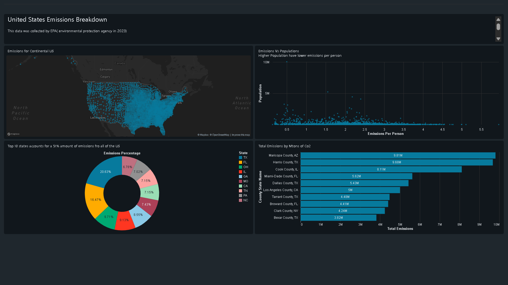

# US Emissions Analysis Dashboard (Databricks)

##  Project Overview
This project analyzes county-level CO₂ emissions across the United States using big data tools.
An interactive dashboard was built in Databricks to visualize emissions distribution, population impact,
and top contributing states and counties.

##  Dashboard Features
- US-wide emissions heatmap (county-level)
- Emissions vs population scatter analysis
- Top 10 states contributing ~51% of total emissions
- Top emitting counties by total CO₂ output

## 🛠 Tech Stack
- Databricks
- PySpark
- SQL
- Data Visualization
- Big Data Analytics

##  Dataset
- Source: EPA (Environmental Protection Agency), 2023
- Level: County & State

##  Dashboard Preview

##  Key Insights
- Emissions are concentrated in a small number of highly industrialized counties
- Higher population does not always correlate with higher per-capita emissions
- Few states dominate national emission figures

##  Future Improvements
- Add time-series emissions trend analysis
- Integrate industry-level emissions
- Build ML model for emissions forecasting

- Databricks Dashboard (internal / view-only):
  https://dbc-aa931216-f0d3.cloud.databricks.com/dashboardsv3/01f0ed1d48161d529e9d0d3a0cbfa2af/published?o=1693169276178715

